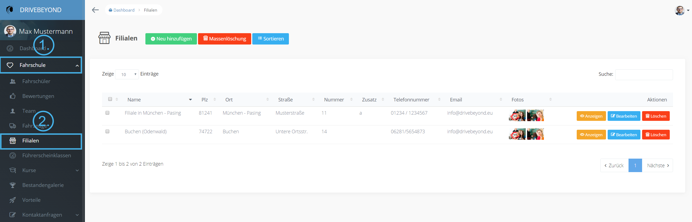
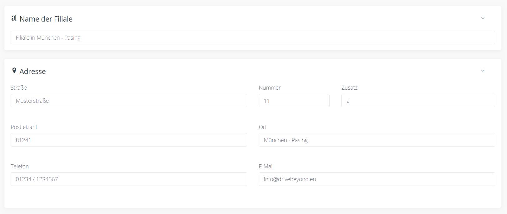
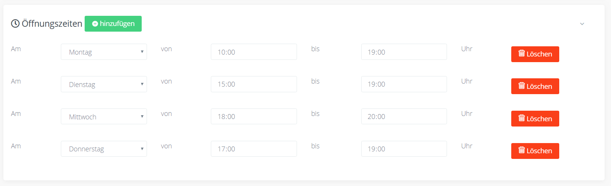
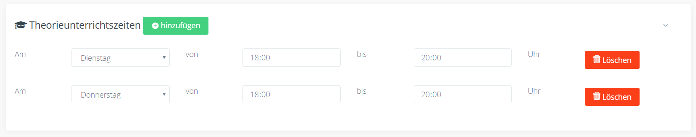
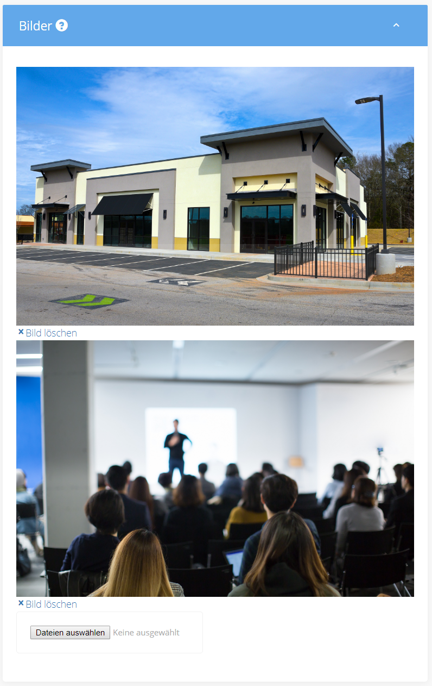
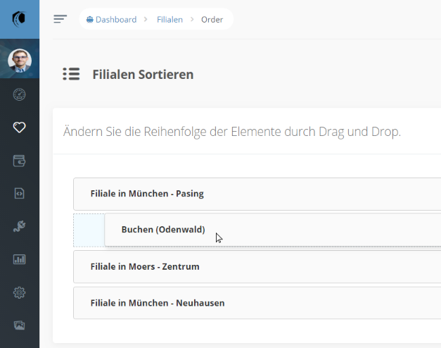
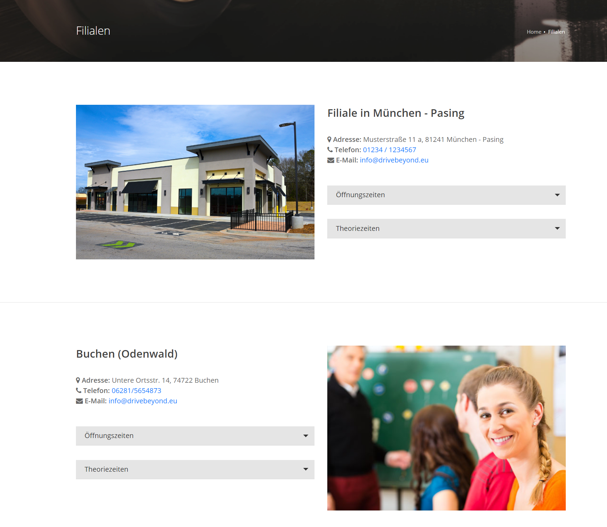

Jede Fahrschule hat mindestens eine Hauptstelle und oft gibt es einige Nebenfilialen in denen Unterricht stattfindet oder es die Möglichkeit zur Anmeldung gibt. Damit Ihre (angehenden) Fahrschüler sofort sehen können, welche Filiale in der Nähe ist und was sie dort zu erwarten haben, haben sie im DriveBeyond Dashboard die Möglichkeit alle Informationen zu hinterlegen.

## Übersicht

Im Dashboard finden Sie Ihre Filialen über das Menü unter Fahrschule -> Filialen.

Hier können Sie Filialen hinzufügen, ansehen, bearbeiten und löschen. Zusätzlich haben Sie die Möglichkeit, die Reihenfolge zu ändern.

## Name und Adresse

Geben Sie hier den Namen der Filialen und die Adress- sowie die Kontaktdaten ein.

## Öffnungszeiten

Mit Klick auf den grünen Button "+ hinzufügen" können Sie einen neuen Eintrag in den Öffnungszeiten erstellen. Mit dem roten Button "löschen" direkt neben dem Eintrag löschen Sie diesen wieder. Achten Sie darauf, dass Sie Öffnungzeiten nicht doppelt eintragen oder Einträge unausgefüllt lassen. Die Einträge werden auf der Webseite geordnet angezeigt.

## Theorieunterrichtszeiten

In dieser Sektion können Sie ausfüllen, wann Theorieunterrichtsstunden in dieser Filiale stattfinden. Die Bedienung findet genauso wie bei den Öffnungszeiten statt.

## Bilder

Wenn Sie die Filiale hinzufügen, muss sie erst gespeichert werden, bevor Bilder hinzugefügt werden können. Fügen Sie mindestens ein Bild hinzu, das die Filiale zeigt. Sie könen auch mehrere Bilder hinzufügen, die dann in einer Slideshow angezeigt werden.

## Sortieren

Klicken Sie auf den blauen Button "Sortieren" in der Filialübersicht um die Reihenfolge auf der Webseite zu verändern. Ziehen Sie nun einfach den Namen der Filiale an die richtige Position. Die Reihenfolge wird automatisch gespeichert.

## Das Resultat

Wie die Webseite im Nachhinein aussieht, können Sie z.B. auf unserer Demo Seite ansehen. ([Filialen DriveBeyond Demo](https://demo.drivebeyond.eu/filialen))

## Seite anlegen

Damit auf Ihrer Webseite die Filialen angezeigt werden, stellen Sie sicher, dass Sie eine Unterseite mit der Vorlage Filialen haben, die den Status "Veröffentlicht" hat. Sie können diese Seite nun im Menü verlinken.
