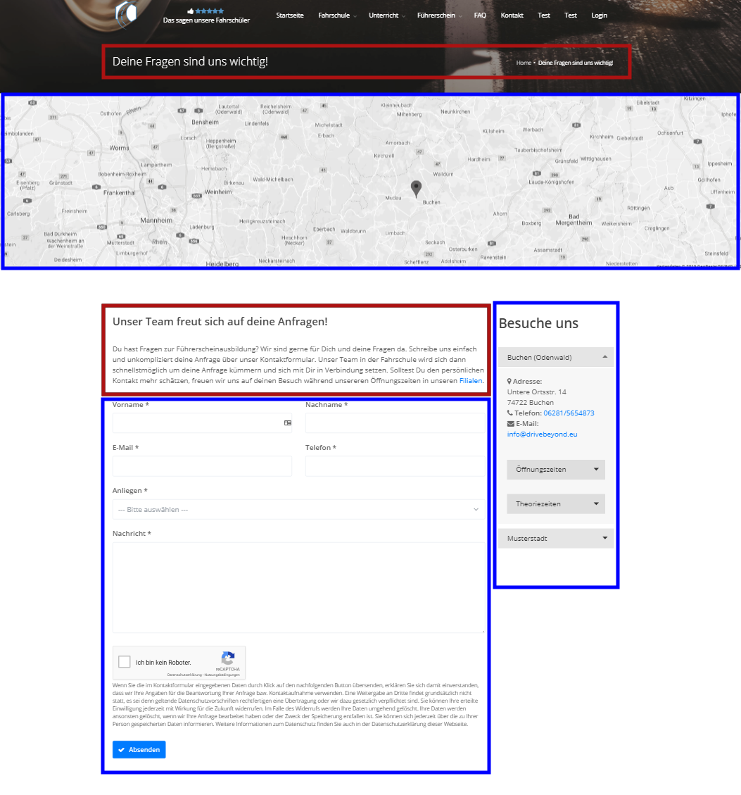

## Übersicht

Im Dashboard finden Sie Ihre Unterseiten über das Menü unter Webseite -> Unterseiten.
Hier können Sie Unterseiten hinzufügen, ansehen, bearbeiten und löschen.
Jede Unterseite stellt einen eigenen Link dar, wie zum Beispiel die Startseite, die Kontaktseite oder das Impressum.

## Seitenvorlagen

Vom DriveBeyond System sind eine ganze Reihe von Unterseiten schon eingespeichert. Wir geben Ihnen für jede Seitenvorlage eine Unterseite vor. Eine Seitenvorlage bedeutet, dass ein bestimmter Bereich schon gestaltet wurde, und sie lediglich ein Teil des Inhaltes verändern können.
Die Vorlage `Kontaktseite` enthält schon das Kontaktformular, die Karte mit den Markierungen zu den einzelnen Filialen und die Infos zu den Filialen. Sie können diese Seite aber weiterhin individualisieren, indem Sie Inhalte hinzufügen, den Titel und die Beschreibung ändern oder den Link ändern.

Die in Blau umrahmten Felder werden durch Einstellungen verändert oder sind vorgegeben. Die in Rot umrahmten Felder können direkt auf der Unterseite eingestellt werden.

## Optionen

### Titel
Der Titel wird ganz oben auf der Seite (unter dem Logo) auf dem Hintergrundbild angezeigt. Dieser wird auch in den Suchmaschinen angezeigt.

### Untertitel
Der Untertitel wird auf dem weißen Bereich der Seite, direkt über dem Inhalt angezeigt.

### Inhalt
Das ist der primäre Inhaltstext der Seite, hier können Sie über den Editor nicht nur Text, sondern auch Bilder, Videos (über Youtube) und Tabellen einfügen.

### Link
Der Link ist die relative Adresse unter der diese Unterseite erreicht werden kann. Bitte lassen Sie die Domain und die Schrägstriche am Anfang/Ende weg.
1. Beispiel: Die Kontakseite soll unter `https://www.ihre-fahrschule.de/kontakt` erreichbar sein. Sie geben einfach `kontakt` ein.
2. Beispiel: Die Kontaktseite soll unter `https://www.ihre-fahrschule.de/kontakt/formular` erreichbar sein.  Sie geben einfach `kontakt/formular` ein.

### Suchmaschinenbeschreibung
Diese Beschreibung wird in den Suchmaschinen angezeigt. Verfassen sie eine kurze (max. 160 Zeichen) und aussagekräftige Beschreibung.

### Status
Sie können entweder den Status `Entwurf` oder `Veröffentlicht` einstellen. Unterseiten, die den Status Entwurf haben, können nicht auf der Webseite angesehen werden, sondern sind nur im Dashboard sichtbar.

### Foto
Hier können Sie ein Foto hochladen, das zwischen Untertitel und Inhalt platziert wird. Das Foto geht über die gesamte Breite des Inhalts. Wenn Sie ein kleineres Foto einfügen möchten, können Sie es über den Editor im Feld Inhalt tun und dieses Feld freilassen.

### Vorlage
Verwenden Sie jede Vorlage nur auf einer Unterseite und nutzen sie sonst die Vorlage `Leere Seite`.