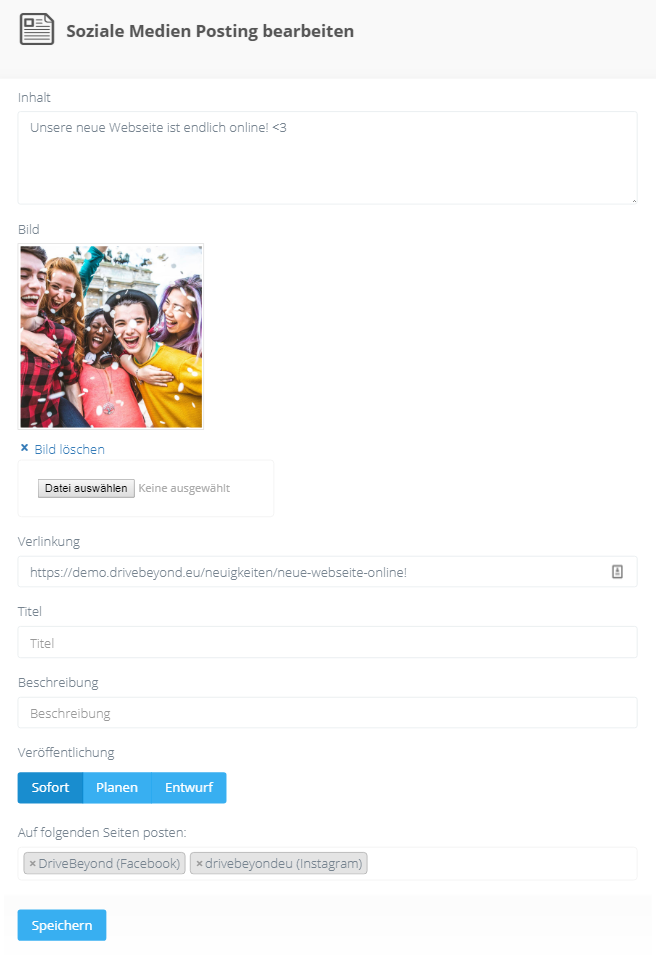

##Übersicht Ihrer Beiträge

Im Dashboard finden Sie alle verknüpften Beiträge im Menü unter `SmartSocial` -> `Beiträge`

##Beitrag erstellen/bearbeiten

Sie haben die Möglichkeit Beiträge für Kurse, Bilder in der Bestandengalerie und Neuigkeiten zu posten, direkt wenn Sie diese erstellen/bearbeiten.

Falls Sie unabhängig davon einen Beitrag erstellen möchten können Sie dies auch einfach unter dem Menüpunkt `SmartSocial` -> `Beiträge` machen.

###Inhalt
Dies ist der Inhalt, der im Beitrag veröffentlicht wird. Sie können Hashtags verwenden.
Limitierung von Instagram: Maximal 2200 Zeichen und 30 Hashtags.

###Bild
Wählen Sie ein Bild von Ihrem Computer aus. Dieses Feld ist für Instagram verpflichtend.

###Verlinkung
Dieser Link wird auf Instagram dem Inhalt angefügt. Bitte beachten Sie, dass bei Instagram Links in Beiträgen nicht anklickbar sind.
Auf Facebook wird der Link so geteilt, dass eine Vorschau des Links erscheint.

####Titel, Beschreibung
Diese betreffen nur die Verlinkung auf Facebook.

###Veröffentlichung

####Sofort
Der Beitrag wird direkt nach dem Speichern veröffentlicht. Es kann jedoch eine Minute dauern, bis der Beitrag auf den jeweiligen sozialen Netzwerken sichtbar ist.

####Planen
Sie erhalten nun die Option `Zeitpunkt` wo sie das Datum und die Zeit für die Veröffentlichung angeben können.

####Entwurf
Der Beitrag wird lediglich in Ihrem Dashboard gespeichert und kann später veröffentlicht werden.

###Auf folgenden Seiten posten
Wählen Sie Ihre Profile aus, auf denen Sie den Beitrag veröffentlichen möchten. Falls Sie keine Seite auswählen, wird der Beitrag erstmal nicht veröffentlicht.
