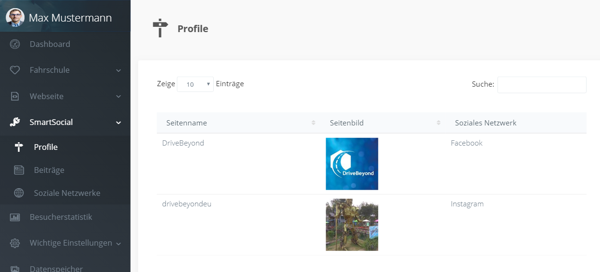
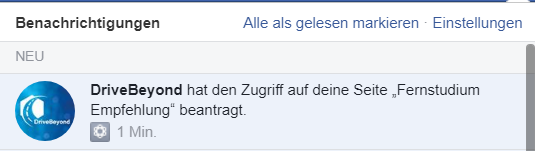
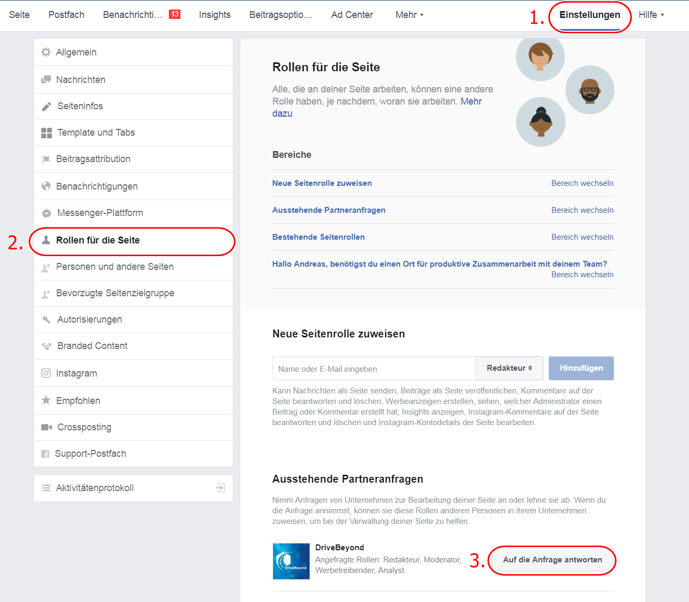
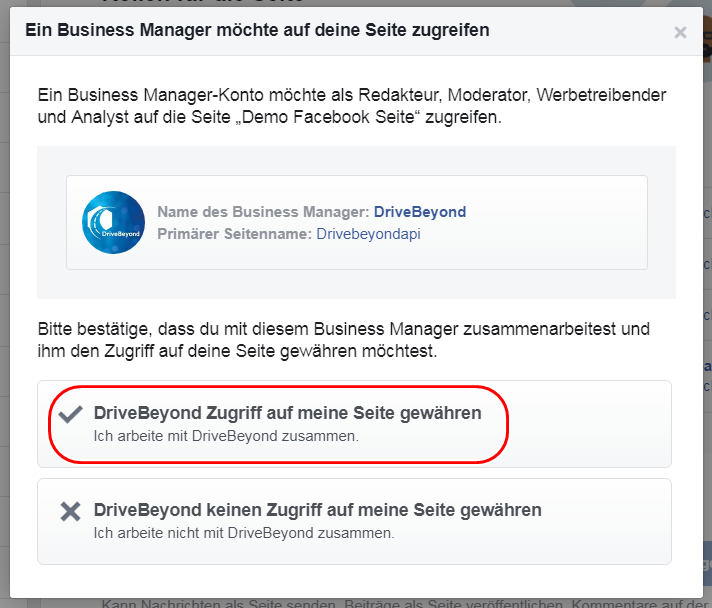

## Übersicht Ihrer Profile

Im Dashboard finden Sie alle verknüpften Profile im Menü unter `SmartSocial` -> `Profile`

## Facebook Seite hinzufügen

1. Schicken Sie uns den Link zu Ihrer Facebook Seite an info@drivebeyond.eu
2. Wir stellen eine Anfrage auf Zugriff zu Ihrer Seite.
3. Sie erhalten eine Benachrichtigung auf Facebook zu der Anfrage.

4. Klicken Sie auf die Benachrichtigung oder gehen Sie auf Ihre Facebook Seite, klicken Sie auf `Einstellungen` und dann auf `Rollen für die Seite`.
5. Unter `Ausstehende Partneranfragen` finden Sie eine Anfrage von DriveBeyond. Klicken Sie den Button `Auf die Anfrage Antworten` an.

6. Lesen Sie die Anfrage und klicken Sie auf `DriveBeyond Zufriff auf meine Seite gewähren`.

## Instagram Profil hinzufügen

1. Prüfen Sie ob Ihr Instagram Profil ein Unternehmenskonto ist. Wandeln Sie es um, falls noch nicht geschehen.
Anleitung: https://www.facebook.com/help/instagram/502981923235522
2. Verknüpfen Sie Ihr Instagram Profil mit Ihrer Facebook Seite.
Anleitung: https://www.facebook.com/help/instagram/356902681064399
3. Schreiben Sie uns eine E-Mail an info@drivebeyond.eu und wir übernehmen die Verbindung von Instagram und Ihrer DriveBeyond Webseite für Sie.

