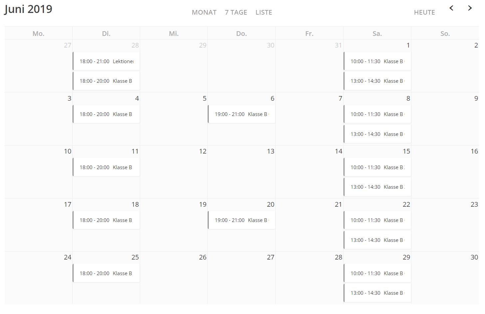
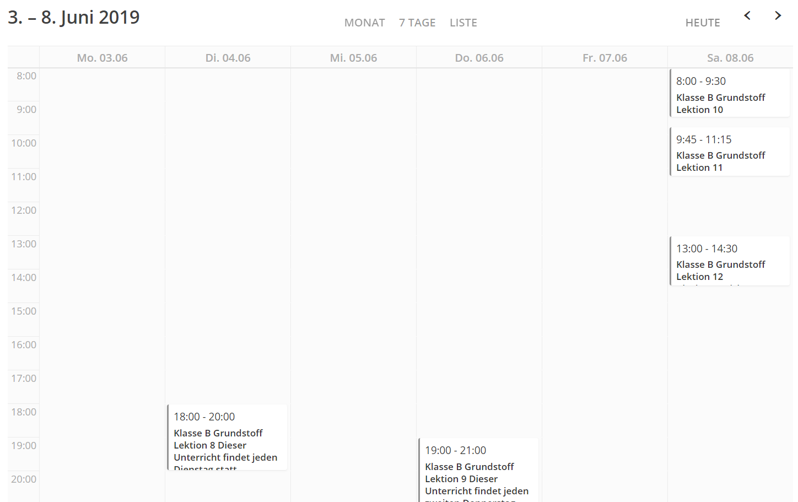
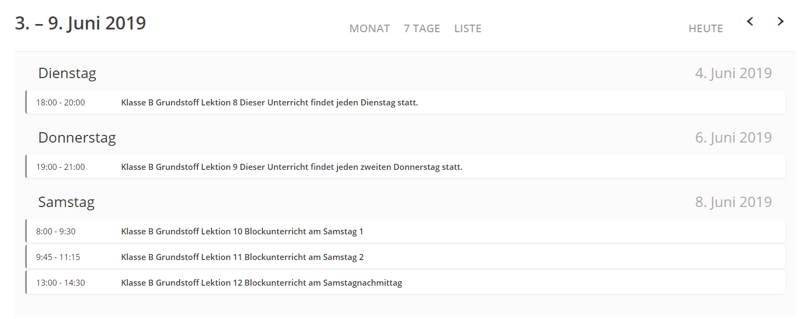
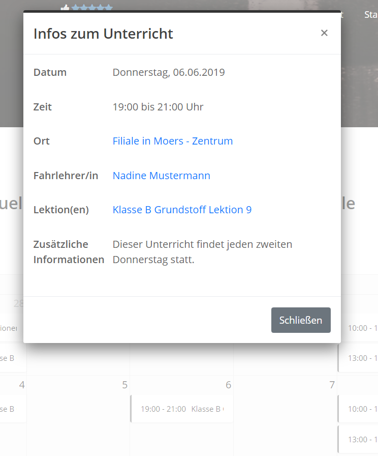
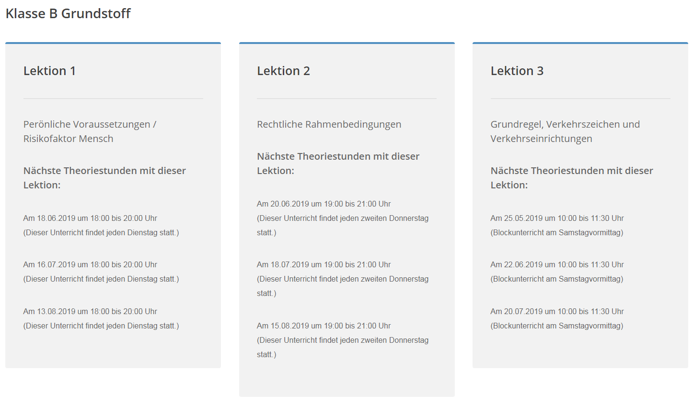

##Voraussetzungen

Stellen Sie sicher, dass Sie eine Unterseite mit der Vorlage Theorieplaner angelegt und veröffentlicht haben. Erst dann ist der Theorieplan auf Ihrer Webseite erreichbar.

##Nächste Theoriestunden

Hier können die Besucher die nächsten Theoriestunden in der Monatsansicht, Wochenansicht oder Listenansicht ansehen.

##Detailansicht

Man kann auf einen einzelnen Termin klicken um mehr Informationen zu erhalten.

##Übersicht der Lektionen

Geordnet nach Kategorien werden hier alle Lektionen dargestellt und dazu auch die nächsten Termine abgerufen.

