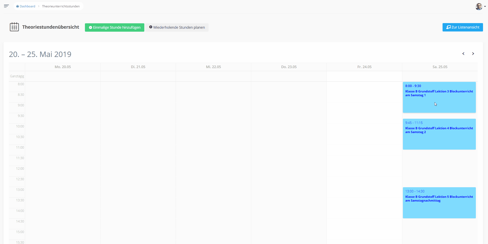
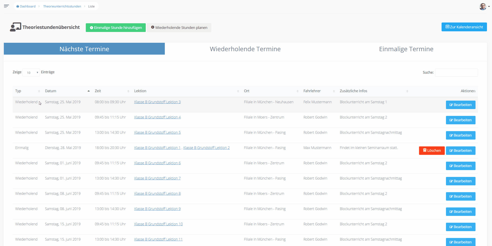
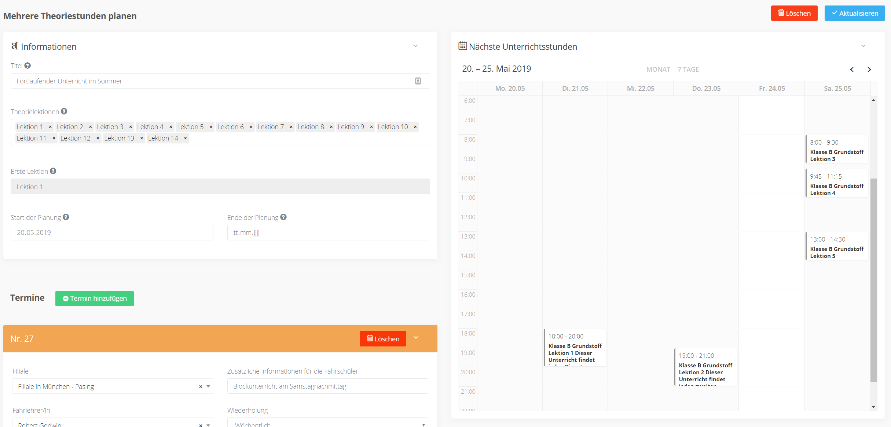
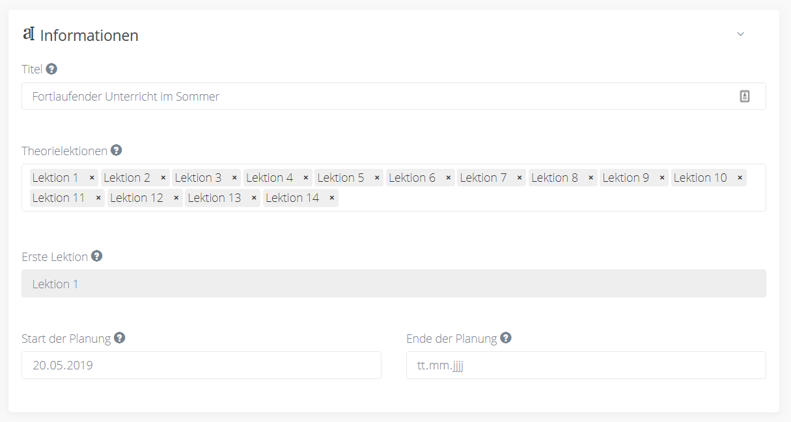
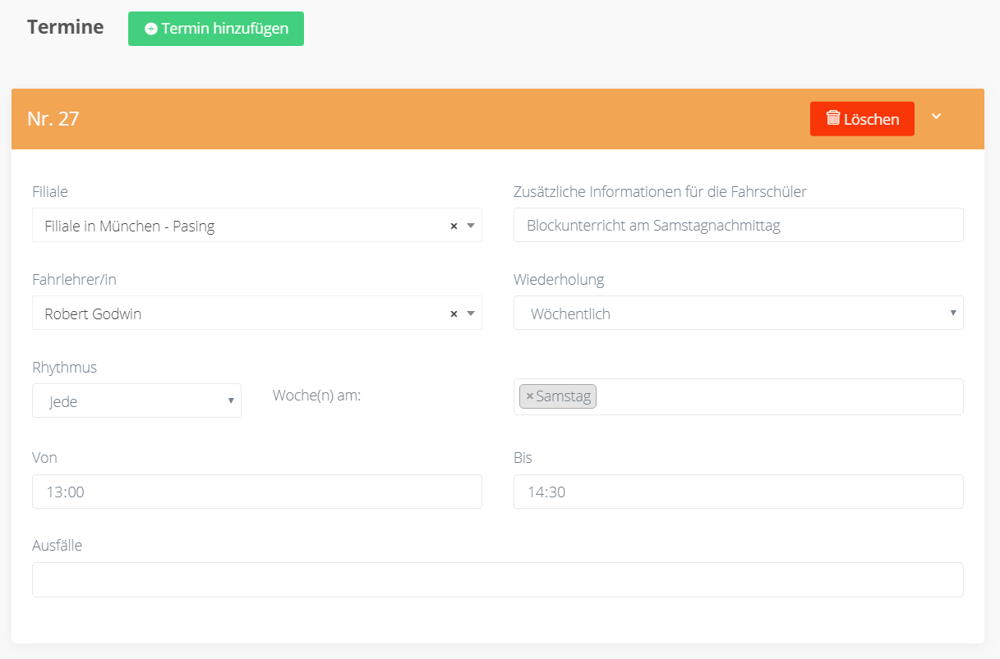
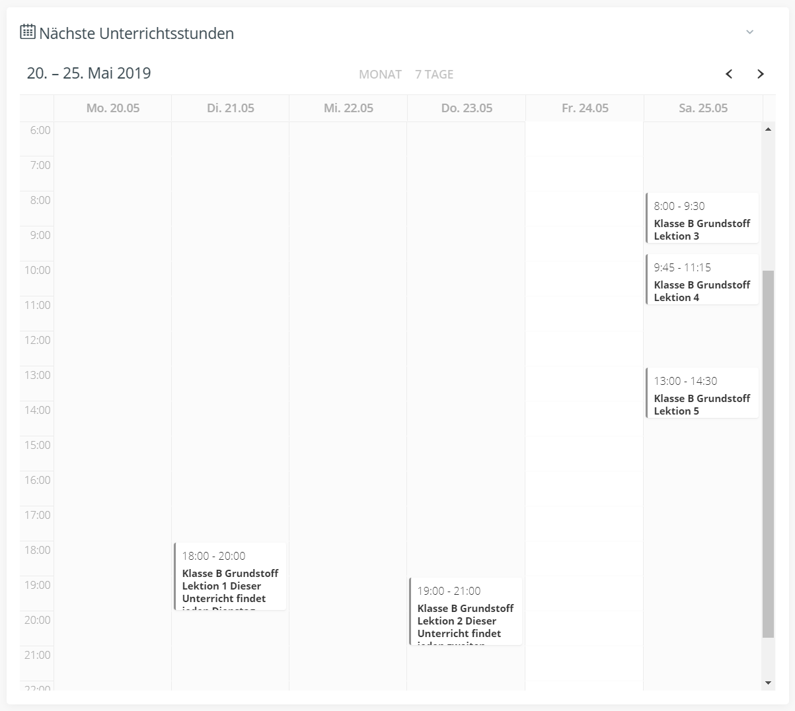
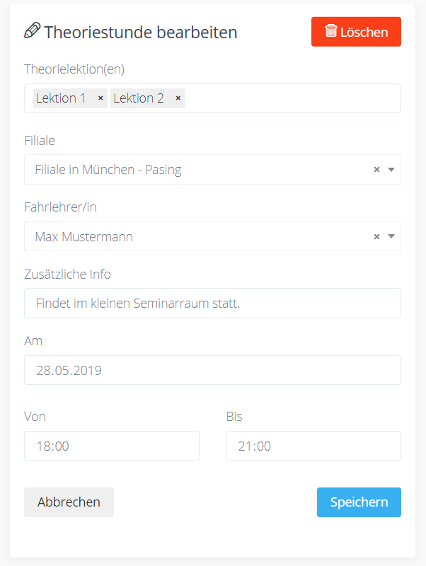

##Kalenderansicht

Die Kalenderansicht stellt alle Theoriestunden in einem Stundenplanartigen Wochenkalender oder Monatskalender dar.

##Listenansicht

`Nächste Termine` Hier werden die Theoriestunden der nächsten Monate in einer Liste dargestellt.

`Wiederholende Termine` Alle Planungen von wiederholenden Theoriestunden unabhängig davon ob sie aktuell sind.

`Einmalige Termine` Alle Theoriestunden die nur für ein bestimmtes Datum geplant werden.

##Planung von Theorieunterrichtsstunden

Sie können den Theorieplaner einsetzen um Ihre Fahrschüler auf der Webseite zum einen darüber zu informieren, welche Lektionen es gibt und zum anderen alle Daten wie (Datum, Zeit, Ort und Fahrlehrer/in) bekannt zu machen.
Fahrschüler/innen können sich so im Voraus aussuchen, welche Theoriestunden sie besuchen und können beispielsweise Doppelungen meiden.

##Wiederholende Theoriestunden

Hier können Sie Theoriestunden planen, die sich in festen Intervallen wiederholen.

###Übersicht

Der Bereich `Informationen` zeigt allgemeine Einstellungen für die ausgewählte Planung.

Der Bereich `Termine` zeigt verschiedene Termine, die Wöchentlich oder Monatlich wiederholt werden.

Der Bereich `Nächste Unterrichtsstunden` zeigt eine Vorschau der Stunden, basierend auf Ihren Eingaben in den vorherigen Bereichen.

###Informationen

####Titel
Der Titel wird nur im Dashboard angezeigt und dient zu Ihrer Referenz.

####Theorielektionen
Wählen Sie alle Lektionen aus, die in den Theoriestunden durchgenommen werden. Sortieren Sie die Lektionen dann per Drag & Drop in der gewünschten Reihenfolge. Wählen Sie zuletzt eine Lektion mit Klick aus, die in der ersten Theoriestunde behandelt wird. Die Lektionen werden in der angegebenen Reihenfolge chronologisch über die Theoriestunden verteilt.

####Start der Planung
Wann die früheste Theoriestunde stattfinden wird. Ist Beispielsweise Montag der 01. Januar ausgewählt und es gibt nur Termine am Dienstag und Donnerstag, dann findet die 1. Theoriestunde am Dienstag den 02.01. statt. Falls Sie dieses Feld freilassen, wird das gegenwärtige Datum genutzt.
####Ende der Planung
Das Datum an dem, bzw. vor dem die letzte Theoriestunde stattfinden soll. Hier können Sie Ihre Planung auf einen festen Zeitraum eingrenzen. Falls Sie dieses Feld freilassen, wird die Planung ständig weitergeführt.

###Termine

####Filiale
Die Filiale, in der die Theoriestunde stattfindet.
####Zusätzliche Informationen für die Fahrschüler
Hier können Sie wichtige Informationen weitergeben, die auf der Webseite angezeigt werden. Beispielsweise Unterrichtsraum, Welche Utensilien mitgebracht werden sollen oder ähnliches
####Fahrlehrer/in
Geben Sie hier die Person an, die die Theoriestunde leitet.
####Wiederholung
Wöchentlich: Wiederholung im Wochen oder Zwei-Wochentakt
Wählen Sie dann den Rhytmus aus Jede, in geraden oder in ungeraden Kalenderwochen.
Wählen Sie nun den Wochentag aus um den es sich handelt. Sie können auch mehrere Wochentage angeben.
Monatlich: Wiederholung jeden Monat oder alle 2, 3, 4 oder 5 Monate. Sie können einen Tag angeben wie z.B.: Alle 3 Monate am 01. oder einen Wochentag im Monat wie z.B.: Jeden Monat am zweiten Donnerstag.
####Uhrzeiten Von/Bis
Anfang und Ende des Unterrichts
####Ausfälle
Falls eine Theoriestunde ausfallen wird, können Sie zu dem entsprechenden Datum blättern (In der Kalenderansicht unter "Nächste Unterrichtsstunden"). Klicken Sie auf den Termin und dann auf den roten Button "Termin absagen"

###Nächste Unterrichtsstunden

Die Kalenderansicht umfasst nur die aktuelle Planung. Einmalige Unterrichtsstunden und weitere Planungen von Wiederholenden Theoriestunden werden nicht berücksichtigt.
Damit die Kalenderansicht korrekt gefüllt wird, müssen Sie bei allen Terminen die Felder korrekt ausfüllen.

##Einmalige Theorieunterrichtsstunden
Planen Sie Unterrichtsstunden, die nicht in einen monatlichen oder wöchentlichen Rhytmus fallen.
Blockunterricht, der nicht regelmäßig stattfindet kann hier erstellt werden.

###Theoriestunden erstellen/bearbeiten

Um eine Theoriestunde zu erstellen klicken Sie entweder in der Kalender oder Listenansicht auf den grünen Button mit dem Text "Einmalige Stunde hinzufügen".
Zum Bearbeiten klicken Sie in der Kalenderansicht auf das Feld mit der Theoriestunde und dann auf bearbeiten. In der Listenansicht ist auf der rechten Seite unter Aktionen der Button "Bearbeiten".

####Theorielektion(en)
Hier haben Sie die Möglichkeit eine oder mehrere Theorielektionen auszuwählen, die behandelt werden.
####Filiale
Die Filiale, in der die Theoriestunde stattfindet.
####Fahrlehrer/in
Geben Sie hier die Person an, die die Theoriestunde leitet.
####Zusätzliche Info
Hier können Sie wichtige Informationen weitergeben, die auf der Webseite angezeigt werden. Beispielsweise Unterrichtsraum, Welche Utensilien mitgebracht werden sollen oder ähnliches
####Am, Von, Bis
Das Datum und die Zeit an der die Theoriestunde stattfindet.

###Theoriestunde löschen
`Kalenderansicht` Klicken Sie auf das Feld mit der Theoriestunde, dann auf "Bearbeiten" und "löschen".

`Listenansicht` Gehen Sie auf Einmalige Termine und klicken Sie auf löschen.